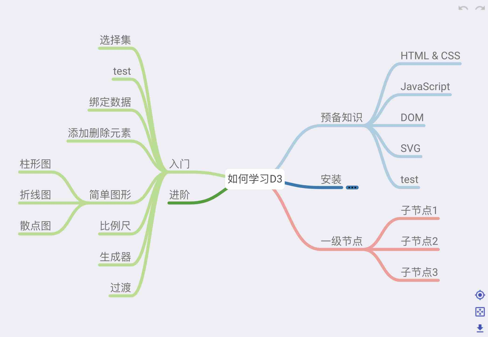

# 思维导图Vue组件，基于d3.js实现

## 根据 <a href="https://github.com/hellowuxin/mindmap" target="_blank">mindmap</a> 进行了一些修改
```
因为原作作者已经不再维护vue2的版本，所以针对自己的业务进行了一些修改
目前实现的功能：
编辑、拖移、缩放、撤销、上下文菜单、折叠、复制、粘贴、搜索、导出图片...
```

## PROPS

| Name            | Type             | Default       | Description
| ---             | ---              | ---           | ---
| v-model         | Data[]           | undefined     | 设置思维导图数据
| width           | Number           | 100%          | 设置思维导图宽度
| height          | Number           | undefined     | 设置思维导图高度
| editable        | Boolean          | true          | 设置节点是否可编辑
| x-spacing       | Number           | 55            | 设置节点横向间隔
| y-spacing       | Number           | 10            | 设置节点纵向间隔
| draggable       | Boolean          | true          | 设置节点是否可拖拽
| gps             | Boolean          | true          | 是否显示居中按钮
| fit-view        | Boolean          | true          | 是否显示缩放按钮
| download        | Boolean          | true          | 是否显示下载按钮
| keyboard        | Boolean          | true          | 是否响应键盘事件
| show-node-add   | Boolean          | true          | 是否显示添加节点按钮
| custom-add      | Boolean          | false         | 是否自定义点击添加按钮事件
| context-menu    | Boolean          | true          | 是否响应右键菜单
| zoomable        | Boolean          | true          | 是否可缩放、拖移
| show-undo       | Boolean          | true          | 是否显示撤销重做按钮
| show-search     | Boolean          | true          | 是否显示搜索框
| show-placeholder| String           | '请输入搜索值' | 输入框的 placeholder
| show-style      | Object           | {}            | 输入框的样式
| show-class-name | String           | ''            | 输入框的className
| stroke-width    | Number           | 2             | 设置连线的宽度
| zoom-step       | Number           | 1             | 缩放频率
| scale-extent    | [Number, Number] | [0.5, 8]      | 设置缩放范围

## Data

| Name           | Type           | Description
| ---            | ---            | ---
| name           | String         | 节点名称
| mid            | String         | 节点唯一id，自动生成
| collapse       | Booble         | 是否折叠
| customAddBtn   | Booble         | 是否自定义点击“添加节点按钮”事件，为true时响应customAdd事件
| left           | Booble         | 节点是否在左侧显示
| isValid        | Booble         | 节点是否有效（文字标红）
| children       | Array(Data)    | 子节点

## EVENTS

| Name           | arguments            | Description
| ---            | ---                  | ---
| updateNodeName | data, mid            | 更新节点名称时，传入节点数据和节点id
| change         | data                 | 更新节点名称时，传入节点数据
| click          | data, mid            | 点击节点时，传入节点数据和节点id
| valid          | data                 | 置为有效
| copy           | data, tragetId       | 需要复制的数据，传入复制的数据和节点id
| paste          | data, parentId       | 复制的数据，传入复制的数据和父节点id
| customAdd      | mid                  | 点击添加节点按钮时响应事件(custom-add为true时触发)，传入节点id

## SLOT
zoom-out-btn
| Name           | Description
| ---            | ---
| zoom-out-btn   | 缩小按钮
| zoom-in-btn    | 放大按钮
| gps-btn        | 重置定位按钮
| fit-btn        | 重置大小按钮
| download-btn   | 下载按钮
| undo-btn       | 回退按钮
| redo-btn       | 前进按钮

## Example

```node.js
npm install
npm run build-lib
```
```html
<template>
  <div id="app">
    <mindmap2 v-model="mindmapData" />
  </div>
</template>

<script>
import mindmap2 from './dist/mindmap.umd.min'
const mindmapData = [
  {
    "name":"如何学习D31",
    "children":
    [
      {
        "name":"预备知识",
        "children": [
          { "name":"HTML & CSS" },
          { "name":"JavaScript" },
          { "name":"DOM" },
          { "name":"SVG" },
          { "name":"test\ntest" }
        ]
      },
      { 
        "name":"安装",
        "collapse": true,
        "children": [
          { "name": "折叠节点" }
        ]
      },
      {
        "name":"入门",
        "children":[
          { "name":"选择集" },
          { "name":"test" },
          { "name":"绑定数据" },
          { "name":"添加删除元素" },
          {
            "name":"简单图形",
            "children":
            [
              { "name":"柱形图" },
              { "name":"折线图" },
              { "name":"散点图" }]
          },
          { "name":"比例尺" },
          { "name":"生成器" },
          { "name":"过渡" }
        ],
        "left": true
      },
      { 
        "name":"进阶",
        "left": true 
      },
      {
        "name":"一级节点",
        "children": [
          { "name":"子节点1" },
          { "name":"子节点2" },
          { "name":"子节点3" }
        ]
      }
    ]
  }
]

export default {
  name: 'App',
  components: { mindmap2 },
  data() {
    return {
      mindmapData: mindmapData
    }
  }
}
</script>
```

## 键盘事件

1、添加子节点：<kbd>⇥ tab</kbd>  
2、添加兄弟节点（根节点同tab）：<kbd>⏎ enter</kbd>  
3、删除节点：<kbd>⌫ backspace</kbd> or <kbd>✖ delete</kbd>  
4、回退：<kbd>⌘ cmd</kbd>+<kbd>z</kbd> or <kbd>ctrl</kbd>+<kbd>z</kbd>   
5、前进：<kbd>⌘ cmd</kbd>+<kbd>y</kbd> or <kbd>ctrl</kbd>+<kbd>y</kbd>   
6、复制：<kbd>⌘ cmd</kbd>+<kbd>c</kbd> or <kbd>ctrl</kbd>+<kbd>c</kbd>   
7、粘贴：<kbd>⌘ cmd</kbd>+<kbd>v</kbd> or <kbd>ctrl</kbd>+<kbd>v</kbd>   

## 交互逻辑

**鼠标**：space+左键移动；ctrl+左键多选；右键菜单；滚轮缩放；
             
**触控板**：双指滚动移动；双指菜单；双指捏合缩放；单指选中

## 已修改

- [x] 以图表中心为原点居中显示，而非根节点
- [x] 复制粘贴
- [x] 搜索框
- [x] 导出图片
- [x] 对缩放的频率进行优化
- [x] ...

## 待完成

- [ ] 编辑时可以根据输入内容进行搜索，发起异步请求展示下拉列表
- [ ] ...
